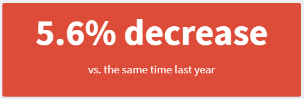

<!-- README.md is generated from README.Rmd. Please edit that file -->

```{r, include = FALSE}
knitr::opts_chunk$set(
  message = FALSE,
  warning = FALSE,
  collapse = TRUE,
  comment = "#>",
  fig.path = "man/figures/README-",
  out.width = "100%"
)
```

# headliner

<!-- badges: start -->
<!-- badges: end -->

The goal of `headliner` is to help analysts to translate facts to insights. In the comparison below ([source](https://blog.prototypr.io/dashboard-design-5-things-every-ux-designer-should-know-a85c4558d75)), both dashboards have the same underlying data but how they present the information to the user is very different.
<div style="text-align:center">
  
</div>

Right now, there isn't anything out of the box to help users dynamically create phrasing like used in the "insights" version without a bit of coding gymnastics. The many ways you could approach it combined with the steps required to say "if positive, show it like this, if negative show it like that" increase the technical debt this kind of code could add to a project. For this reason, `headliner` is designed to deliver the building blocks required to create these phrases for plot titles, value boxes in `shiny` or section headers in a report.

## Installation

You can install the dev version of `headliner` from [github](https://github.com/rjake/headliner) with:

``` r
devtools::install_github("rjake/headliner")
```

## Usage

For these examples, I will use a function called `demo_data()` to build a data set based on the current date `r format(Sys.Date(), "%D")`.
```{r eval=FALSE}
library(headliner)
demo_data()
```

```{r echo=FALSE}
devtools::load_all()
demo_data()
```


What we want is to say something like this:
```{r, echo=FALSE}
demo_data() %>%
  add_date_columns(date) %>% 
  compare_conditions(
    compare = month == 0,
    reference = month == -12,
    cols = x
  ) %>% 
  headline(
    headline = "We have seen a {delta_p}% {trend} compared to the same time \\
    last year ({orig_values})."
  )
```

We can look at the data an see that about 12 months ago, x was 107 where as today it is 101. We can give these values to `headline()` and get a simple phrase
```{r}
headline(compare = 101, reference = 107)
```

To see how the sentence was constructed, we can look at the components used under the hood. This `return_data = TRUE` returns a named list.  I will condense with `view_list()`

```{r}
headline(101, 107, return_data = TRUE) %>% 
  view_list()
```

We can compose it like this using `glue::glue()` syntax
```{r}
headline(
  101, 107, 
  "We have seen {article_delta_p} {delta_p}% {trend} compared to the same time last year ({orig_values})."
)
```
You might have noticed that there are multiple `article_*` components available. `article_delta` is for the difference between the two values ("**a** 6 person loss" vs "**an** 8 person loss"), `article_delta_p` is for the percentage difference for "**a** 5.6%" vs "**an** 8.6%", and `article_trend` gives us "**an** increase" vs "**a** decrease".


But let's see if we can make the calculations more dynamic...

First, we can use a function called `add_date_columns()` to calculate distances from the current date (or the refence date specified) to the values in the `date` column . With these new fields we can see that `r format(demo_data()$date[2], "%D")` was 60 days ago (or 9 weeks or 2 months, ...) from the current date.
```{r}
demo_data() %>%
  add_date_columns(date_col = date)
```

We can then identify some conditions for our comparison (`compare`) and our reference group (`reference`). This step uses the kind of logic you would use in `dplyr::filter()` or `base::subset()`
```{r}
yoy <- # year over year
  demo_data() %>%
  add_date_columns(date) %>% 
  compare_conditions(
    compare = (month == 0),     # this month
    reference = (month == -12), # vs 12 months ago
    cols = c(x),                # the column(s) to aggregate
    calc = list(mean = mean)    # the list of functions passed to summarise(across(...))
  )

yoy
```

It might look funny to see `list(mean = mean)`. The name (left side) is how it will name the values, the right side is the function to use. If I had used `calc = list(avg = mean)` The names would have been `avg_x_*`. Because `compare_conditions()` uses the mean as the default, I'll omit it going forward. Now that I have my output as a list (or 1 row data frame), I can pipe it into `headline()` to see the underlying data. 

```{r}
yoy %>% 
  headline(
    headline = "We have seen a {delta_p}% {trend} compared to the same time last year ({orig_values})."
  ) 
```

You can add phrases to customize your sentences. `plural_phrases()` allows you to add new variables to the list of components available. Here I am adding `{people}` for use in my headline.
```{r}
headline(
  compare = 10, 
  reference = 8,
  headline =  
    "There is {article_trend} {trend} of {delta} {people} enrolled \\
    {article_delta_p} {delta_p}% {trend} ({orig_values})",
  plural_phrases = list(  
    people = plural_phrasing(single = "person", multi = "people")
  )
)
```

Notice the difference in these two outputs
```{r}
more_less <- # "more" & "less" instead of "increase" & "decrease" defaults
  trend_terms(more = "more", less = "less")

are_people <-
  list(
    are = plural_phrasing(single = "is", multi = "are"),
    people = plural_phrasing(single = "person", multi = "people")
  )

headline(
  compare = 1, 
  reference = 2,
  headline = "There {are} {delta} {trend} {people}",
  trend_phrasing = more_less,
  plural_phrases = are_people
)

headline(
  compare = 3, 
  reference = 1,
  headline = "There {are} {delta} {trend} {people}",
  trend_phrasing = more_less,
  plural_phrases = are_people
)
```

You can also adjust the text if the numbers are the same
```{r}
headline(3, 3)

headline(3, 3, if_match = "There were no additional applicants ({comp_value} total)")
```


`headline()` can also be used in a `valueBox()` for `shiny`
```{r eval=FALSE}
box_color <- ifelse(yoy$sign == -1, "red", "blue")

valueBox(
  value = headline(yoy, headline = '{delta_p}% {trend}'),
  subtitle = "vs. the same time last year",
  color = box_color
) 
```

<div style="text-align:center">
  
</div>


```{r echo=FALSE, eval=FALSE}
library(shinydashboard)

shinyApp(
  ui = dashboardPage(
   dashboardHeader(title = "Value boxes"),
    dashboardSidebar(),
    dashboardBody(
      fluidRow(
        valueBox("5.6% decrease", "vs. the same time last year", color = "red")
      )
      )
   ),
  server = function(input, output) {}
)
```

If your list/data frame has more than 2 values, you can specify the values you need by calling their names
```{r}
car_stats <-
  mtcars %>% 
  compare_conditions(
    compare = cyl == 4,
    reference = cyl > 4,
    cols = starts_with("d"),
    calc = list(avg = mean, min = min)
  )

view_list(car_stats)

headline(
  car_stats,
  avg_disp_comp,
  avg_disp_ref,
  "Difference in avg. displacement of {delta}cu.in. ({orig_values})"
)

headline(
  car_stats,
  avg_drat_comp,
  avg_drat_ref,
  "Difference in avg. rear axle ratio of {delta} ({orig_values})"
)
```

If your data has more than one row, you can use `purrr::map2_chr()` to get multiple headlines (may be simplified in a future release)
```{r}
library(tidyverse)

flights_jfk %>% 
  head(3) %>% 
  select(arr_delay, dep_delay) %>% 
  mutate(
    headline = map2_chr( # from purrr
      .x = arr_delay, 
      .y = dep_delay, 
      headline,
      headline = "Difference of {raw_delta} minutes"
    )
  )
```

`compare_conditions()` can also be used to compare categorical criteria.
```{r}
demo_data() %>%
  compare_conditions(
    compare = group == "a",
    reference = group == "c",
    cols = c(x)
  ) %>% 
  headline(
    headline = "Group A ({comp_value}) is {delta} points {trend} Group C ({ref_value})",
    trend_phrasing = trend_terms(more = "ahead",  less = "behind")
  )
```
