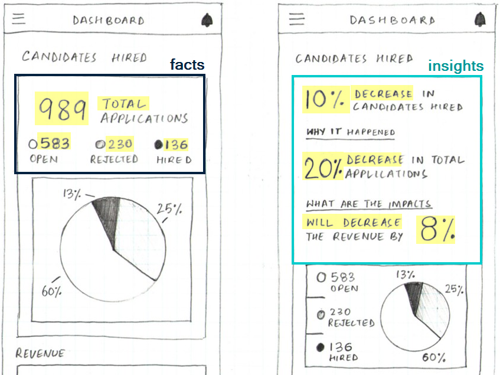
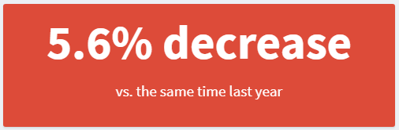

<!-- README.md is generated from README.Rmd. Please edit that file -->

# headliner

<!-- badges: start -->

<!-- badges: end -->

The goal of `headliner` is to help analysts to translate facts to
insights. In the comparison below
([source](https://blog.prototypr.io/dashboard-design-5-things-every-ux-designer-should-know-a85c4558d75)),
both dashboards have the same underlying data but how they present the
information to the user is very different.

<div style="text-align:center">



</div>

Right now, there isn’t anything out of the box to help users dynamically
create phrasing like used in the “insights” version without a bit of
coding gymnastics. The many ways you could approach it combined with the
steps required to say “if positive, show it like this, if negative show
it like that” increase the technical debt this kind of code could add to
a project. For this reason, `headliner` is designed to deliver the
building blocks required to create these phrases for plot titles, value
boxes in `shiny` or section headers in a report.

## Installation

You can install the dev version of `headliner` from
[github](https://github.com/rjake/headliner) with:

``` r
devtools::install_github("rjake/headliner")
```

## Usage

For these examples, I will use a function called `demo_data()` to build
a data set based on the current date 09/11/20.

``` r
library(headliner)
demo_data()
```

    #> # A tibble: 10 x 5
    #>    group     x     y     z date      
    #>    <chr> <dbl> <dbl> <dbl> <date>    
    #>  1 a       101    10     1 2020-09-11
    #>  2 a       102    20     0 2020-07-13
    #>  3 b       103    30     1 2020-05-14
    #>  4 b       104    40     0 2020-03-15
    #>  5 c       105    50     1 2020-01-15
    #>  6 c       106    60     0 2019-11-16
    #>  7 d       107    70     1 2019-09-17
    #>  8 d       108    80     0 2019-07-19
    #>  9 e       109    90     1 2019-05-20
    #> 10 e       110   100     0 2019-03-21

What we want is to say something like this:

    #> We have seen a 5.6% decrease compared to the same time last year (101 vs. 107).

We can look at the data an see that about 12 months ago, x was 107 where
as today it is 101. We can give these values to `headline()` and get a
simple phrase

``` r
headline(compare = 101, reference = 107)
#> decrease of 6 (101 vs. 107)
```

To see how the sentence was constructed, we can look at the components
used under the hood. This `return_data = TRUE` returns a named list. I
will condense with `view_list()`

``` r
headline(101, 107, return_data = TRUE) %>% 
  view_list()
#>                                      VALUES
#> delta                                     6
#> trend                              decrease
#> delta_p                                 5.6
#> article_delta                             a
#> article_delta_p                           a
#> article_trend                             a
#> comp_value                              101
#> ref_value                               107
#> raw_delta                                -6
#> raw_delta_p                            -5.6
#> sign                                     -1
#> orig_values                     101 vs. 107
#> headline        decrease of 6 (101 vs. 107)
```

We can compose it like this using `glue::glue()` syntax

``` r
headline(
  101, 107, 
  "We have seen {article_delta_p} {delta_p}% {trend} compared to the same time last year ({orig_values})."
)
#> We have seen a 5.6% decrease compared to the same time last year (101 vs. 107).
```

You might have noticed that there are multiple `article_*` components
available. `article_delta` is for the difference between the two values
(“**a** 6 person loss” vs “**an** 8 person loss”), `article_delta_p` is
for the percentage difference for “**a** 5.6%” vs “**an** 8.6%”, and
`article_trend` gives us “**an** increase” vs “**a** decrease”.

But let’s see if we can make the calculations more dynamic…

First, we can use a function called `add_date_columns()` to calculate
distances from the current date (or the refence date specified) to the
values in the `date` column . With these new fields we can see that
07/13/20 was 60 days ago (or 9 weeks or 2 months, …) from the current
date.

``` r
demo_data() %>%
  add_date_columns(date_col = date)
#> # A tibble: 10 x 11
#>    group     x     y     z date         day  week month quarter calendar_year
#>    <chr> <dbl> <dbl> <dbl> <date>     <dbl> <dbl> <dbl>   <dbl>         <dbl>
#>  1 a       101    10     1 2020-09-11     0     0     0       0             0
#>  2 a       102    20     0 2020-07-13   -60    -8    -2       0             0
#>  3 b       103    30     1 2020-05-14  -120   -17    -4      -1             0
#>  4 b       104    40     0 2020-03-15  -180   -26    -6      -2             0
#>  5 c       105    50     1 2020-01-15  -240   -34    -8      -2             0
#>  6 c       106    60     0 2019-11-16  -300   -43   -10      -3            -1
#>  7 d       107    70     1 2019-09-17  -360   -51   -12      -4            -1
#>  8 d       108    80     0 2019-07-19  -420   -60   -14      -4            -1
#>  9 e       109    90     1 2019-05-20  -480   -68   -16      -5            -1
#> 10 e       110   100     0 2019-03-21  -540   -77   -18      -6            -1
#> # ... with 1 more variable: fiscal_year <dbl>
```

We can then identify some conditions for our comparison (`compare`) and
our reference group (`reference`). This step uses the kind of logic you
would use in `dplyr::filter()` or `base::subset()`

``` r
yoy <- # year over year
  demo_data() %>%
  add_date_columns(date) %>% 
  compare_conditions(
    compare = (month == 0),     # this month
    reference = (month == -12), # vs 12 months ago
    cols = c(x),                # the column(s) to aggregate
    calc = list(mean = mean)    # the list of functions passed to summarise(across(...))
  )

yoy
#> $mean_x_comp
#> [1] 101
#> 
#> $mean_x_ref
#> [1] 107
```

It might look funny to see `list(mean = mean)`. The name (left side) is
how it will name the values, the right side is the function to use. If I
had used `calc = list(avg = mean)` The names would have been `avg_x_*`.
Because `compare_conditions()` uses the mean as the default, I’ll omit
it going forward. Now that I have my output as a list (or 1 row data
frame), I can pipe it into `headline()` to see the underlying data.

``` r
yoy %>% 
  headline(
    headline = "We have seen a {delta_p}% {trend} compared to the same time last year ({orig_values})."
  ) 
#> We have seen a 5.6% decrease compared to the same time last year (101 vs. 107).
```

You can add phrases to customize your sentences. `plural_phrases()`
allows you to add new variables to the list of components available.
Here I am adding `{people}` for use in my headline.

``` r
headline(
  compare = 10, 
  reference = 8,
  headline =  
    "There is {article_trend} {trend} of {delta} {people} enrolled \\
    {article_delta_p} {delta_p}% {trend} ({orig_values})",
  plural_phrases = list(  
    people = plural_phrasing(single = "person", multi = "people")
  )
)
#> There is an increase of 2 people enrolled a 25% increase (10 vs. 8)
```

Notice the difference in these two outputs

``` r
more_less <- # "more" & "less" instead of "increase" & "decrease" defaults
  trend_terms(more = "more", less = "less")

are_people <-
  list(
    are = plural_phrasing(single = "is", multi = "are"),
    people = plural_phrasing(single = "person", multi = "people")
  )

headline(
  compare = 1, 
  reference = 2,
  headline = "There {are} {delta} {trend} {people}",
  trend_phrasing = more_less,
  plural_phrases = are_people
)
#> There is 1 less person

headline(
  compare = 3, 
  reference = 1,
  headline = "There {are} {delta} {trend} {people}",
  trend_phrasing = more_less,
  plural_phrases = are_people
)
#> There are 2 more people
```

You can also adjust the text if the numbers are the same

``` r
headline(3, 3)
#> There was no difference.

headline(3, 3, if_match = "There were no additional applicants ({comp_value} total)")
#> There were no additional applicants (3 total)
```

`headline()` can also be used in a `valueBox()` for `shiny`

``` r
box_color <- ifelse(yoy$sign == -1, "red", "blue")

valueBox(
  value = headline(yoy, headline = '{delta_p}% {trend}'),
  subtitle = "vs. the same time last year",
  color = box_color
) 
```

<div style="text-align:center">



</div>

If your list/data frame has more than 2 values, you can specify the
values you need by calling their names

``` r
car_stats <-
  mtcars %>% 
  compare_conditions(
    compare = cyl == 4,
    reference = cyl > 4,
    cols = starts_with("d"),
    calc = list(avg = mean, min = min)
  )

view_list(car_stats)
#>               VALUES
#> avg_disp_comp 105.14
#> avg_disp_ref  296.50
#> avg_drat_comp   4.07
#> avg_drat_ref    3.35
#> min_disp_comp  71.10
#> min_disp_ref  145.00
#> min_drat_comp   3.69
#> min_drat_ref    2.76

headline(
  car_stats,
  avg_disp_comp,
  avg_disp_ref,
  "Difference in avg. displacement of {delta}cu.in. ({orig_values})"
)
#> Difference in avg. displacement of 191.4cu.in. (105.1 vs. 296.5)

headline(
  car_stats,
  avg_drat_comp,
  avg_drat_ref,
  "Difference in avg. rear axle ratio of {delta} ({orig_values})"
)
#> Difference in avg. rear axle ratio of 0.7 (4.1 vs. 3.3)
```

If your data has more than one row, you can use `purrr::map2_chr()` to
get multiple headlines (may be simplified in a future release)

``` r
library(tidyverse)

flights_jfk %>% 
  head(3) %>% 
  select(arr_delay, dep_delay) %>% 
  mutate(
    headline = map2_chr( # from purrr
      .x = arr_delay, 
      .y = dep_delay, 
      headline,
      headline = "Difference of {raw_delta} minutes"
    )
  )
#> # A tibble: 3 x 3
#>   arr_delay dep_delay headline                 
#>       <dbl>     <dbl> <chr>                    
#> 1         6        -4 Difference of 10 minutes 
#> 2        10        21 Difference of -11 minutes
#> 3         2        -4 Difference of 6 minutes
```

`compare_conditions()` can also be used to compare categorical criteria.

``` r
demo_data() %>%
  compare_conditions(
    compare = group == "a",
    reference = group == "c",
    cols = c(x)
  ) %>% 
  headline(
    headline = "Group A ({comp_value}) is {delta} points {trend} Group C ({ref_value})",
    trend_phrasing = trend_terms(more = "ahead",  less = "behind")
  )
#> Group A (101.5) is 4 points behind Group C (105.5)
```
