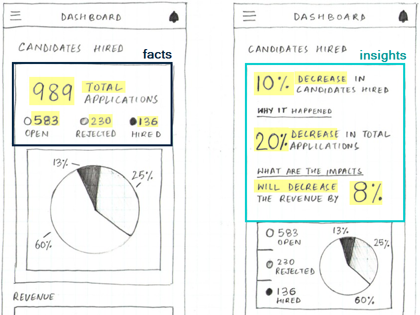

```{r, include = FALSE}
knitr::opts_chunk$set(
  message = FALSE,
  warning = FALSE,
  collapse = TRUE,
  comment = "#>",
  out.width = "100%"
)
```


The goal of `headliner` is to help analysts to translate facts to insights. In the comparison below ([source](https://blog.prototypr.io/dashboard-design-5-things-every-ux-designer-should-know-a85c4558d75)), both dashboards have the same underlying data but how they present the information to the user is very different.

<div style="text-align:center">
  
</div>

Right now, there isn't anything out of the box to help users dynamically create phrasing like used in the "insights" version without a bit of coding gymnastics. The many ways you could approach it combined with the steps required to say "if positive, show it like this, if negative show it like that" increase the technical debt this kind of code could add to a project. For this reason, `headliner` is designed to deliver the building blocks required to create these phrases for plot titles, value boxes in `shiny` or section headers in a report.

## Installation

You can install the dev version of `headliner` from [github](https://github.com/rjake/headliner) with:

``` r
devtools::install_github("rjake/headliner")
```

### Installation

For these examples, I will use a function called `demo_data()` to build a data set based on the current date (this was last run on `r format(Sys.Date(), "%D")`).
```{r}
library(headliner)
library(dplyr)
demo_data()
```

```{r echo=FALSE}
dates <- 
  demo_data() |>
  add_date_columns(date) |> 
  slice(2) |> 
  mutate(dplyr::across(day:month, abs))
```

### A simple headline

What we want is to say something like this:
```{r, echo=FALSE}
demo_data() |>
  add_date_columns(date) |> 
  compare_conditions(
    x = month == 0,
    y = month == -12,
    .cols = sales
  ) |> 
  headline_list(
    headline = 
    "We have seen {article_delta_p}% {trend} compared to the same time last year ({orig_values})."
  )
```

We can look at the data an see that about 12 months ago, `sales` was 107 where as today it is 101. We can give these values to `headline()` and get a simple phrase
```{r}
headline(
  x = 101, 
  y = 107
)
```

To see how the sentence was constructed, we can look at the components used under the hood. This `return_data = TRUE` returns a named list.  I will condense with `view_list()`

```{r}
headline(101, 107, return_data = TRUE) |> 
  view_list()
```

### A custom headline
We can compose it like this using `glue::glue()` syntax
```{r}
headline(
  x = 101, 
  y = 107, 
  headline = "We have seen {article_delta_p}% {trend} compared to the same time last year ({orig_values})."
)
```
You might have noticed that there are multiple `article_*` components available. `article_delta` is for the difference between the two values ("**a** 6 person loss" vs "**an** 8 person loss"), `article_delta_p` is for the percentage difference for "**a** 5.6%" vs "**an** 8.6%". You can also add articles to words using `add_article()`. For example `add_artice("increase")` gives us "**an** increase" vs `add_artice("decrease")` "**a** decrease".


### Helpers for dynamic calculations
But let's see if we can make the calculations more dynamic...

First, we can use a function called `add_date_columns()` to calculate distances from the current date (or the reference date specified) to the values in the `date` column . With these new fields we can see that `r format(demo_data()$date[2], "%D")` was `r dates$day` days ago (or `r dates$week` weeks or `r dates$month` months, ...) from the current date.
```{r}
demo_data() |>
  add_date_columns(date_col = date)
```

We can then identify some conditions for our group of interest (`x`) and our reference group (`y`). This step uses the kind of logic you would use in `dplyr::filter()` or `base::subset()` + the logic used by `dplyr::across()`
```{r}
yoy <- # year over year
  demo_data() |>
  add_date_columns(date) |> 
  compare_conditions(
    x = (month == 0),   # this month
    y = (month == -12), # vs 12 months ago
    .cols = sales,   # the column(s) to aggregate
    .fns = lst(mean)    # the list of functions passed to summarise(across(...))
  )

yoy
```

The argument `lst(mean)` is equivalent to writing `list(mean = mean)`. The name (left side) is how it will name the column, the right side is the function to use. If I had used `.fns = list(avg = mean)` The names would have been `avg_sales_x` and `avg_sales_y` and used `mean()` as the calculation. Because `compare_conditions()` uses the mean as the default, I'll omit it going forward. 

You may want to do other steps with the data frame but if you want to go right into a headline, you can use `headline_list()`. Another good option for adding headlines to data frames is `add_headline_column()` (see next section)

```{r}
yoy |> 
  headline_list(
    headline = "We have seen {article_delta_p}% {trend} compared to the same time last year ({orig_values})."
  ) 
```

If your result  has more than 2 values, you can specify the values you need by calling their names
```{r}
car_stats <-
  mtcars |> 
  compare_conditions(
    x = cyl == 4,
    y = cyl > 4,
    .cols = starts_with("d"),
    .fns = list(avg = mean, min = min)
  )

view_list(car_stats)

car_stats |>
  headline_list(
    x = avg_disp_x,
    y = avg_disp_y,
    headline = "Difference in avg. displacement of {delta}cu.in. ({orig_values})"
  )

car_stats |>
  headline_list(
    x = avg_drat_x,
    y = avg_drat_y,
    headline = "Difference in avg. rear axle ratio of {delta} ({orig_values})"
  )
```

`compare_conditions()` can also be used to compare categorical criteria.
```{r}
demo_data() |>
  compare_conditions(
    x = group == "a",
    y = group == "c",
    .cols = c(sales),
    .fns = sum
  ) |> 
  headline_list(
    headline = "Group A is ${delta} {trend} Group C (${x} vs ${y})",
    trend_phrases = trend_terms(more = "ahead",  less = "behind")
  )
```

### Within a data frame

You can also use `add_headline_column()` to append a column to your data frame with headlines describing each row. You can reference existing columns in the headline and you can bring back specific talking points using `return_cols = `. You can use this to find the most interesting phrases.
```{r}
tibble::tibble(
  med = tail(LETTERS, 5),
  lab = rep(c("HDL", "LDL"), length.out = 5),
  pre = 70 + 1:5,
  post = 70 + 6:2
) |> 
  add_headline_column(
    x = post, 
    y = pre,
    headline = "Using Brand {med}, {lab} {trend}d by {delta} mg/dL",
    return_cols = c("delta")
  ) |> 
  arrange(desc(delta))

```


### Adding plural phrasing & multiple trend terms

You can add phrases to customize your sentences. `plural_phrases()` allows you to add new variables to the list of components available. Here I am adding `{people}` for use in my headline.
```{r}
headline(
  x = 9,
  y = 10,
  headline = "{delta_p}% {trend} ({delta} {people})",
  plural_phrases = list(  
    people = plural_phrasing(single = "person", multi = "people")
  )
)
```

You can actually pass multiple `trend_terms()` and `plural_phrasing()` options. 
```{r}
# lists to use
more_less <- 
  list(
    an_increase = trend_terms("an increase", "a decrease"), 
    more = trend_terms(more = "more", less = "less")
  )

are_people <-
  list(
    are = plural_phrasing(single = "is", multi = "are"),
    people = plural_phrasing(single = "person", multi = "people")
  )

# notice the difference in these two outputs
headline(
  x = 25, 
  y = 23,
  headline = "There {are} {delta} {more} {people} ({an_increase} of {delta_p}%)",
  trend_phrases = more_less,
  plural_phrases = are_people
)

headline(
  x = 25, 
  y = 26,
  headline = "There {are} {delta} {more} {people} ({an_increase} of {delta_p}%)",
  trend_phrases = more_less,
  plural_phrases = are_people
)
```

### When there's no change

You can also adjust the text if the numbers are the same
```{r}
headline(3, 3)

headline(3, 3, if_match = "There were no additional applicants ({x} total)")
```

### An example with `valueBox()`

Here's an example that uses `headliner` to create a `valueBox()` in `shiny` with dynamic colors and text.

```{r eval=FALSE}
show <- compare_values(101, 107)
box_color <- ifelse(show$sign == -1, "red", "blue")

valueBox(
  value = 
    headline(
      show$x, 
      show$y, 
      headline = "{delta_p}% {trend}"
    ),
  subtitle = "vs. the same time last year",
  color = box_color
)
```

<div style="text-align:center">
  
</div>


```{r echo=FALSE, eval=FALSE}
library(shiny)
library(shinydashboard)

show <- compare_values(101, 107)
box_color <- ifelse(show$sign == -1, "red", "blue")

shinyApp(
  ui = dashboardPage(
   dashboardHeader(title = "Value boxes"),
    dashboardSidebar(),
    dashboardBody(
      fluidRow(
        valueBox(
          value =  headline(show$x, show$y, headline = '{delta_p}% {trend}'),
          subtitle = "vs. the same time last year",
          color = box_color,
          width = 5
        )
      )
    )
  ),
  server = function(input, output) {}
)
```


